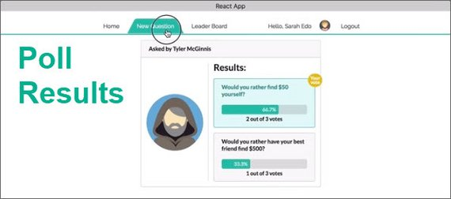
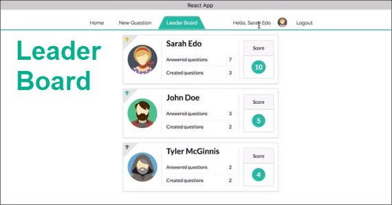
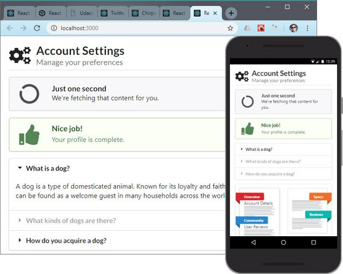
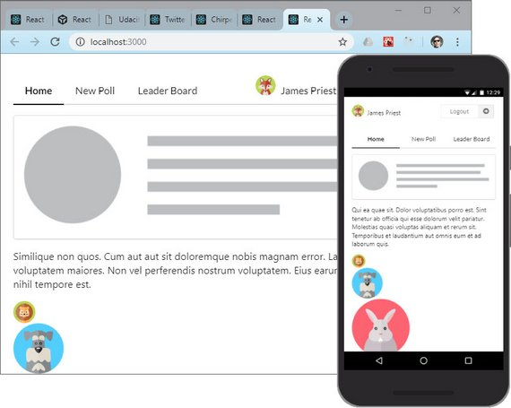
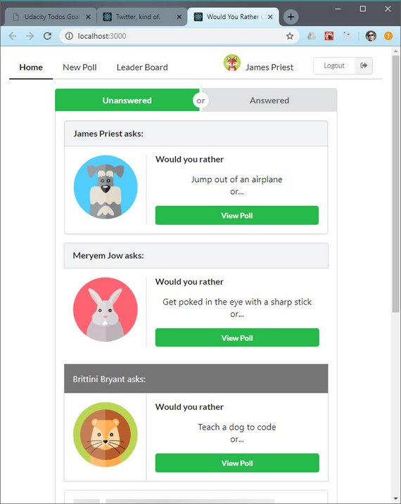

<!-- markdownlint-disable MD022 MD024 MD032 MD033 -->
# Code Notes

This site contains code notes for project 2 of my Udacity React Nanodegree project. Click the link below for more information on the course.
- [Udacity's React Nanodegree Program](https://www.udacity.com/course/react-nanodegree--nd019)

---

## 1. Project Requirements
### 1.1 Overview
The assignment is to build an app called "Would You Rather".

The "Would You Rather" app is a game that presents the user with a poll in the form of:

> Would you rather...
>
> - Option A
> - Option B

The user will be able to answer the question and upon answering will be able to see the polling results.

The app will allow users to

- view polls
- answer poll questions
- see which polls haven't been answered yet
- see how other people have voted
- create their own poll questions
- see the ranking of users on a leader board

#### 1.1.1 Why this project
This project will solidify your understanding of React and Redux while giving you a chance to express your creativity. You’ll practice

- improving the predictability of your application’s state
- establish strict rules for getting, listening, and updating the store
- identify what state should live inside of Redux and what state should live inside of React components

#### 1.1.2 Starter Code
The [starter code](https://github.com/udacity/reactnd-project-would-you-rather-starter) will consist of a `_DATA.js` file, which represents a fake database and contains methods that let you access the data. The README file outlines how the data is stored and details the methods you can use to access the database.

The only thing you need to edit in the `_DATA.js` file is the value of `avatarURL`. Each user should have an avatar, so you’ll need to add a path to each user’s avatar.

Here is the data provided in `_DATA.js`.

<!-- cspell:disable -->

```js
// _DATA.js
let users = {
  sarahedo: {
    id: 'sarahedo',
    name: 'Sarah Edo',
    avatarURL: ,
    answers: {
      "8xf0y6ziyjabvozdd253nd": 'optionOne',
      "6ni6ok3ym7mf1p33lnez": 'optionTwo',
      "am8ehyc8byjqgar0jgpub9": 'optionTwo',
      "loxhs1bqm25b708cmbf3g": 'optionTwo'
    },
    questions: ['8xf0y6ziyjabvozdd253nd', 'am8ehyc8byjqgar0jgpub9']
  },
  tylermcginnis: {
    id: 'tylermcginnis',
    name: 'Tyler McGinnis',
    avatarURL: ,
    answers: {
      "vthrdm985a262al8qx3do": 'optionOne',
      "xj352vofupe1dqz9emx13r": 'optionTwo',
    },
    questions: ['loxhs1bqm25b708cmbf3g', 'vthrdm985a262al8qx3do'],
  },
  johndoe: {
    id: 'johndoe',
    name: 'John Doe',
    avatarURL: ,
    answers: {
      "xj352vofupe1dqz9emx13r": 'optionOne',
      "vthrdm985a262al8qx3do": 'optionTwo',
      "6ni6ok3ym7mf1p33lnez": 'optionTwo'
    },
    questions: ['6ni6ok3ym7mf1p33lnez', 'xj352vofupe1dqz9emx13r'],
  }
}

let questions = {
  "8xf0y6ziyjabvozdd253nd": {
    id: '8xf0y6ziyjabvozdd253nd',
    author: 'sarahedo',
    timestamp: 1467166872634,
    optionOne: {
      votes: ['sarahedo'],
      text: 'have horrible short term memory',
    },
    optionTwo: {
      votes: [],
      text: 'have horrible long term memory'
    }
  },
  "6ni6ok3ym7mf1p33lnez": {
    id: '6ni6ok3ym7mf1p33lnez',
    author: 'johndoe',
    timestamp: 1468479767190,
    optionOne: {
      votes: [],
      text: 'become a superhero',
    },
    optionTwo: {
      votes: ['johndoe', 'sarahedo'],
      text: 'become a supervillain'
    }
  },
  "am8ehyc8byjqgar0jgpub9": {
    id: 'am8ehyc8byjqgar0jgpub9',
    author: 'sarahedo',
    timestamp: 1488579767190,
    optionOne: {
      votes: [],
      text: 'be telekinetic',
    },
    optionTwo: {
      votes: ['sarahedo'],
      text: 'be telepathic'
    }
  },
  "loxhs1bqm25b708cmbf3g": {
    id: 'loxhs1bqm25b708cmbf3g',
    author: 'tylermcginnis',
    timestamp: 1482579767190,
    optionOne: {
      votes: [],
      text: 'be a front-end developer',
    },
    optionTwo: {
      votes: ['sarahedo'],
      text: 'be a back-end developer'
    }
  },
  "vthrdm985a262al8qx3do": {
    id: 'vthrdm985a262al8qx3do',
    author: 'tylermcginnis',
    timestamp: 1489579767190,
    optionOne: {
      votes: ['tylermcginnis'],
      text: 'find $50 yourself',
    },
    optionTwo: {
      votes: ['johndoe'],
      text: 'have your best friend find $500'
    }
  },
  "xj352vofupe1dqz9emx13r": {
    id: 'xj352vofupe1dqz9emx13r',
    author: 'johndoe',
    timestamp: 1493579767190,
    optionOne: {
      votes: ['johndoe'],
      text: 'write JavaScript',
    },
    optionTwo: {
      votes: ['tylermcginnis'],
      text: 'write Swift'
    }
  },
}
```

<!-- cspell:enable -->

Here are the existing database methods which we'll want to create an API wrapper around.

```js
// _DATA.js
function generateUID () {
  return Math.random().toString(36).substring(2, 15) + Math.random()
    .toString(36).substring(2, 15)
}

export function _getUsers () {
  return new Promise((res, rej) => {
    setTimeout(() => res({...users}), 1000)
  })
}

export function _getQuestions () {
  return new Promise((res, rej) => {
    setTimeout(() => res({...questions}), 1000)
  })
}

function formatQuestion ({ optionOneText, optionTwoText, author }) {
  return {
    id: generateUID(),
    timestamp: Date.now(),
    author,
    optionOne: {
      votes: [],
      text: optionOneText,
    },
    optionTwo: {
      votes: [],
      text: optionTwoText,
    }
  }
}

export function _saveQuestion (question) {
  return new Promise((res, rej) => {
    const authedUser = question.author;
    const formattedQuestion = formatQuestion(question);

    setTimeout(() => {
      questions = {
        ...questions,
        [formattedQuestion.id]: formattedQuestion
      }

      users = {
        ...users,
        [authedUser]: {
          ...users[authedUser],
          questions: users[authedUser].questions.concat([formattedQuestion.id])
        }
      }

      res(formattedQuestion)
    }, 1000)
  })
}

export function _saveQuestionAnswer ({ authedUser, qid, answer }) {
  return new Promise((res, rej) => {
    setTimeout(() => {
      users = {
        ...users,
        [authedUser]: {
          ...users[authedUser],
          answers: {
            ...users[authedUser].answers,
            [qid]: answer
          }
        }
      }

      questions = {
        ...questions,
        [qid]: {
          ...questions[qid],
          [answer]: {
            ...questions[qid][answer],
            votes: questions[qid][answer].votes.concat([authedUser])
          }
        }
      }

      res()
    }, 500)
  })
}
```

Using the provided starter code, you will build a React/Redux front end for the application.

### 1.2 App Functionality
The person using your application should have a way of impersonating/logging in as an existing user. (This could be as simple as having a login box that appears at the root of the application that lets the user select a name from the list of existing users. Alternatively, you could create your own account creation process to allow a user to sign up for an account.) Your application should work correctly regardless of which user is selected. Once the user logs in, the home page should be shown.

We always want to make sure we know who the logged in user is, so information about the logged in user should appear on the page. If someone tries to navigate anywhere by entering the address in the address bar, the user is asked to sign in and then the requested page is shown. The application allows the user to log out and log back in.

Once the user logs in, the user should be able to toggle between his/her answered and unanswered polls on the home page, which is located at the root. The polls in both categories are arranged from the most recently created (top) to the least recently created (bottom). The unanswered questions should be shown by default, and the name of the logged in user should be visible on the page.

What would be the point of seeing answered and unanswered polling questions if we couldn’t actually vote or see the results? Each polling question should link to the details of that poll. The details of each poll should be available at `questions/:question_id`.

When a poll is clicked on the home page, the following is shown:

- Text “Would You Rather”;
- Avatar of the user who posted the polling question; and
- Two answer options.

For answered polls, each of the two answer options contains the following:

- Text of the option;
- Number of people who voted for that option; and
- Percentage of people who voted for that option.

The option selected by the logged-in user should be clearly marked.

Since we want to make sure our application creates a good user experience, the application should show a 404 page if the user is trying to access a poll that does not exist. (Please keep in mind that newly created polls will not be accessible at their url because of the way the backend is set up in this application.) It should also display a navigation bar so that the user can easily navigate anywhere in the application.

So what happens when someone votes in a poll? Upon voting in a poll, all of the information of an answered poll should be displayed. The user’s response should be recorded and clearly visible on the poll details page. Users can only vote once per poll; they shouldn’t be allowed to change their answer after they’ve voted -- no cheating allowed! When the user comes back to the home page, the polling question should appear in the “Answered” column.

It would be no fun to vote in polls if we couldn’t post our own questions! The form for posting new polling questions should be available at the `/add` route. The application should show the text “Would You Rather” and have a form for creating two options. Upon submitting the form, a new poll should be created, the user should be taken to the home page, and the new polling question should appear in the correct category on the home page.

But how can we know how many questions each user has asked and answered? Let’s get some healthy competition going here! The application should have a leaderboard that’s available at the `/leaderboard` route. Each entry on the leaderboard should contain the following:

- User’s name;
- User’s picture;
- Number of questions the user asked; and
- Number of questions the user answered

Users should be ordered in descending order based on the sum of the number of questions they’ve asked and the number of questions they’ve answered. The more questions you ask and answer, the higher up you move.

The user should be able to navigate to the leaderboard, to a specific question, and to the form that allows the user to create a new poll both from within the app and by typing in the address into the address bar. To make sure we’re showing the data that is relevant to the user, the application should require the user to be signed in order to access those pages.

### 1.3 App Architecture
By walking through the [Planning Stage and the Coding Stage of the Chirper Project](https://james-priest.github.io/udacity-nanodegree-react/course-notes/react-redux.html#72-project-walkthrough), we’ve given you a useful template for building Redux applications. We recommend using this template for building your “Would You Rather?” Project. Remember that planning your project and its architecture before starting to code will save you a lot of debugging time later on!

For this application, most of the application’s state should be managed by Redux. You’ll find that there are situations where it makes sense to store state outside of the Redux store. Check out what Dan Abramov, the creator of Redux, thinks about [choosing between Redux's store and React's state](https://github.com/reactjs/redux/issues/1287).

Your application’s store should be the source of truth, and components should read the necessary state from the store instead of having their own versions of the same state. There should be no direct API calls in components’ lifecycle methods, and updates should be triggered by dispatching action creators.

Your application’s code should be structured and organized in a logical way, and your components should be modular and reusable.

### 1.4 Project Instructions
1) Use React to build your application’s UI. Remember that composition is key. It’s rarely a mistake to break a component into smaller pieces. Look for opportunities to reuse your components.

2) We recommend using Create React App to generate your submission since it's the easiest way to ensure you have everything the project reviewer will need to install and run your app.

3) By walking through the Planning Stage and the Coding Stage of the Chirper Project, we’ve given you a useful template for building Redux applications. We recommend using this template for building your “Would You Rather?” Project. Remember that planning your project and its architecture before starting to code will save you a lot of debugging time later on!

4) Use Redux to manage your application state. For this application, most of the application’s state should be managed by Redux. You may use component state to handle form input fields and controlled components. Otherwise, the rest of the state for your application should be controlled by your reducers.

5) While the focus (and specification) of this project is based on functionality rather than styling, please ensure that your app is presentable and easy to navigate.

6) Please carefully test your app against the [rubric](https://review.udacity.com/#!/rubrics/1567/view) to make sure all of the rubric requirements are met. Your project must meet all of the rubric criteria in order to pass.

### 1.5 Sample Project UI
We encourage you to get creative with your projects by adding additional functionality and/or styling (after you've ensured that the project meets all of the specifications in the rubric)!

Here's a set of screenshots that show a sample project.

[](../assets/images/wyr1.jpg)<br>
<span class="center bold">Login page</span>

[](../assets/images/wyr2.jpg)<br>
<span class="center bold">Home page</span>

[](../assets/images/wyr3.jpg)<br>
<span class="center bold">Poll page</span>

[](../assets/images/wyr4.jpg)<br>
<span class="center bold">Poll Results</span>

[](../assets/images/wyr5.jpg)<br>
<span class="center bold">Create Question</span>

[](../assets/images/wyr6.jpg)<br>
<span class="center bold">Leader Board</span>

### 1.6 Step-by-Step Guide
#### 1.6.1 Planning Stage 📐
##### Step 1 - Draw All of the Views of the App (Visual Design Stage)
We need to determine the look and functionality of each view in your app. One of the best approaches is to draw each view of the app on paper so that you'll have a good idea of what information and data you're planning to have on each page.

Instead of paper and pencil, you can be a bit more digital and use [software for creating mockups](https://codingsans.com/blog/mockup-tools). If you were given project specifications, check your mock against them to make sure that you have all of the required features.

##### Step 2 - Break Each View Into a Hierarchy of Components
For this step,

- Draw boxes around every component
- Arrange the components into a hierarchy

##### Step 3 - Determine What Events Happen in the App
We need to take a look at what is happening in each component. Let's determine what actions the app or the user is performing on the data. Is the data being set, modified, or deleted?...then we'll need an action to keep track of that event!

##### Step 4 - Determine What Data Lives in the Store
Remember that the main problems that Redux (and the react-redux bindings!) was meant to solve were:

- Propagation of props through the entire component tree.
- Ensuring consistency and predictability of the state across the app.

According to Dan Abramov, the creator of Redux, we should follow the following principle for determining whether to store a piece of data in the store or in a React component:

> *"Use Redux for state that matters globally or is mutated in complex ways… The rule of thumb is: do whatever is less awkward."*

For further information about this take a look at

- [Organizing State](https://redux.js.org/faq/organizing-state)
- [How to choose between Redux's store and React's state?](https://github.com/reactjs/redux/issues/1287)

#### 1.6.2 Coding Stage🔨

**Step 1** - Design the [shape of the state](https://redux.js.org/recipes/structuringreducers/normalizingstateshape) and [create reducers](https://redux.js.org/basics/reducers).

**Step 2** - Create a [Redux store](https://redux.js.org/api/store). Connect logger middleware (optional) and Redux Thunk middleware (alternatively, you can use Redux Saga, etc.).

**Step 3** - For each view that needs access to the store, create the component and connect it to the store.

**Step 4** - For the component you created in the last step, create actions and action creators. Check that everything works correctly.

**Step 5** - Repeat Step 3 & Step 4 for each component that needs access to the store.

**Step 6** - Create presentational components and confirm that everything works correctly.

**Step 7** - Add React Router.

**Step 8** - Add finishing touches and make sure the project meets the [rubric](https://review.udacity.com/#!/rubrics/1567/view).

Remember, this is just a template. As you build more projects, you'll modify this template to suit your needs. You may also find it more intuitive to use a different approach. Regardless of the approach you take, however, **planning out your app is imperative to success**.

## 2. Visual Design Stage
### 2.1 Semantic UI React
This stage of the process consists of drawing or mocking up each of the app's views.

I started with pencil and paper and then began looking for a React UI library to accommodate the look and feel.

I settled on [Sematic UI React](https://react.semantic-ui.com/). It comes pre-baked with many of the UI layouts and controls necessary to meet the requirements.

Additionally, the docs are awesome. They have samples and CodeSandbox instances embedded in every page for easy testing and modification.

### 2.2 UI Testing
I played around with various components from the Semantic-UI-React library and tested how involved the implementation was going to be. It turned out to be pretty  straight-forward.

#### 2.2.1 UITest1
Here I tested a handful of random components that you can see from the import list.

```jsx
// UITest1.js
import React, { Component } from 'react';
import { Accordion, Grid, Header, Icon, Image, Label, Message, Segment }
  from 'semantic-ui-react';

const AccountSettingsHeader = props => (
  <Header as="h2" {...props}>
    <Icon name="settings" />
    <Header.Content>
      Account Settings
      <Header.Subheader>Manage your preferences</Header.Subheader>
    </Header.Content>
  </Header>
);

const FetchingMessage = () => (
  <Message icon>
    <Icon name="circle notched" loading />
    <Message.Content>
      <Message.Header>Just one second</Message.Header>
      We're fetching that content for you.
    </Message.Content>
  </Message>
);

const panels = [
  {
    key: 'what-is-dog',
    title: 'What is a dog?',
    content: [
      'A dog is a type of domesticated animal. Known for its loyalty and',
      'faithfulness guest in many households across the world.'
    ].join(' ')
  },
  ...
];

const LabelRibbons = () => (
  <Segment>
    <Grid columns={2}>
      <Grid.Column>
        <Segment raised>
          <Label as="a" color="red" ribbon>
            Overview
          </Label>
          <span>Account Details</span>

          <Image src="/images/wireframe/paragraph.png" />

          <Label as="a" color="blue" ribbon>
            Community
          </Label>
          <span>User Reviews</span>

          <Image src="/images/wireframe/paragraph.png" />
        </Segment>
      </Grid.Column>

      <Grid.Column>
        <Segment>
          <Label as="a" color="orange" ribbon="right">
            Specs
          </Label>
          <Image src="/images/wireframe/paragraph.png" />

          <Label as="a" color="teal" ribbon="right">
            Reviews
          </Label>
          <Image src="/images/wireframe/paragraph.png" />
        </Segment>
      </Grid.Column>
    </Grid>
  </Segment>
);

export default class UITest1 extends Component {
  render() {
    return (
      <div>
        <AccountSettingsHeader dividing />
        <FetchingMessage />
        <Message
          success
          icon="thumbs up"
          header="Nice job!"
          content="Your profile is complete."
        />
        <Accordion defaultActiveIndex={0} panels={panels} styled />
        <LabelRibbons />
      </div>
    );
  }
}
```

Here's the output of that this code.

[](../assets/images/wyr7.jpg)<br>
<span class="center bold">UITest1.js</span>

#### 2.2.2 UITest2
I also did a second test to see what the menu and nav system looked like. I wanted to make sure these were responsive and adjusted well on mobile.

I had to bump up the font size a bit but overall the components scaled well.

You can also see which components I used from the import list.

```jsx
// UITest2.js
import React, { Component, Fragment } from 'react';
import faker from 'faker';
import { Menu, Segment, Responsive, Image, Grid, Icon, Button }
  from 'semantic-ui-react';

export class UITest2 extends Component {
  state = { activeItem: 'home' };

  handleItemClick = (e, { name }) => this.setState({ activeItem: name });

  render() {
    const { activeItem } = this.state;
    return (
      <div>
        <Responsive as={Menu} minWidth={651} pointing secondary>
          <Menu.Item
            name="home"
            active={activeItem === 'home'}
            onClick={this.handleItemClick}
          />
          <Menu.Item
            name="new poll"
            active={activeItem === 'new poll'}
            onClick={this.handleItemClick}
          />
          <Menu.Item
            name="leader board"
            active={activeItem === 'leader board'}
            onClick={this.handleItemClick}
          />
          <Menu.Menu position="right">
            <Menu.Item>
              <span>
                <Image
                  src="images/avatars/fox.png"
                  avatar
                  spaced="right"
                  verticalAlign="bottom"
                />
                James Priest
              </span>
            </Menu.Item>
            <Menu.Item>
              <Button
                content="Logout"
                icon="arrow alternate circle right"
                labelPosition="right"
                basic
                compact
              />
            </Menu.Item>
          </Menu.Menu>
        </Responsive>
        <Responsive as={Fragment} minWidth={375} maxWidth={650}>
          <Grid columns={2}>
            <Grid.Row>
              <Grid.Column>
                <Image
                  src="images/avatars/fox.png"
                  avatar
                  spaced="right"
                  verticalAlign="bottom"
                />
                James Priest
              </Grid.Column>
              <Grid.Column verticalAlign="bottom" textAlign="right">
                <Button
                  content="Logout"
                  icon="arrow alternate circle right"
                  labelPosition="right"
                  basic
                  compact
                />
              </Grid.Column>
            </Grid.Row>
            <Grid.Row>
              <Grid.Column width={16}>
                <Menu pointing secondary widths={3}>
                  <Menu.Item
                    name="home"
                    active={activeItem === 'home'}
                    onClick={this.handleItemClick}
                  />
                  <Menu.Item
                    name="new poll"
                    active={activeItem === 'new poll'}
                    onClick={this.handleItemClick}
                  />
                  <Menu.Item
                    name="leader board"
                    active={activeItem === 'leader board'}
                    onClick={this.handleItemClick}
                  />
                </Menu>
              </Grid.Column>
            </Grid.Row>
          </Grid>
        </Responsive>
        <Responsive as={Fragment} maxWidth={374}>
          <Grid>
            <Grid.Row>
              <Grid.Column>
                <Image
                  src="images/avatars/fox.png"
                  avatar
                  spaced="right"
                  verticalAlign="bottom"
                />
                James Priest
                <Button
                  content="Logout"
                  icon="arrow alternate circle right"
                  labelPosition="right"
                  basic
                  compact
                  floated="right"
                />
              </Grid.Column>
            </Grid.Row>
            <Grid.Row>
              {/* <Grid.Column> */}
              <Menu pointing secondary widths={3}>
                <Menu.Item
                  name="home"
                  active={activeItem === 'home'}
                  onClick={this.handleItemClick}
                />
                <Menu.Item
                  name="new poll"
                  active={activeItem === 'new poll'}
                  onClick={this.handleItemClick}
                />
                <Menu.Item
                  name="leader board"
                  active={activeItem === 'leader board'}
                  onClick={this.handleItemClick}
                />
              </Menu>
              {/* </Grid.Column> */}
            </Grid.Row>
          </Grid>
        </Responsive>

        <Segment>
          
        </Segment>
        <p>{faker.lorem.paragraphs(1)}</p>
        <Image src="images/avatars/lion.png" size="mini" />
        <Image src="images/avatars/dog.png" size="tiny" />
        <Image src="images/avatars/rabbit.png" size="small" />
        <Image src="images/avatars/koala.png" size="medium" />
      </div>
    );
  }
}

export default UITest2;
```

One of the things that Semantic UI React has is a Responsive control that can be used to show a different UI based on `min-width` or `max-width`.

I created three breakpoint width for the navigation menu to use. Here's the UI.

[](../assets/images/wyr8.jpg)<br>
<span class="center bold">UITest2.js</span>

### 2.3 UI Mockups
For the visual design stage I took a pencil to paper in order to draw out a rough sketch of each View. This showed me that I had  seven views to create.

- Nav
- Home
- Poll Question
- Poll Answered
- New Poll
- Leaderboard
- Login

From there I decided to go straight into building my mockups using [Semantic-UI-React](https://react.semantic-ui.com/) in order to get up to speed on the UI framework.

This would give me a chance to see which layouts, controls, and components work best to display the data.

#### 2.3.1 Sample Page

[](../assets/images/wyr9.jpg)<br>
Live Demo: [Would You Rather App@4-ui-mockups](https://codesandbox.io/s/github/james-priest/reactnd-project-would-you-rather/tree/4-ui-mockups/?fontsize=14) on CodeSandbox

### 2.4 Mockup - Nav
I split out the navigation into a Nav component that is responsive and scales well on mobile devices.

```jsx
// Nav.js
import React, { Component, Fragment } from 'react';
import {
  Menu,
  Responsive,
  Image,
  Grid,
  Button,
  Container
} from 'semantic-ui-react';

export class Nav extends Component {
  state = { activeItem: 'home' };

  handleItemClick = (e, { name }) => this.setState({ activeItem: name });

  render() {
    const { activeItem } = this.state;
    return (
      <Container>
        <Responsive as={Menu} minWidth={651} pointing secondary>
          <Menu.Item
            name="home"
            active={activeItem === 'home'}
            onClick={this.handleItemClick}
          />
          <Menu.Item
            name="new poll"
            active={activeItem === 'new poll'}
            onClick={this.handleItemClick}
          />
          <Menu.Item
            name="leader board"
            active={activeItem === 'leader board'}
            onClick={this.handleItemClick}
          />
          <Menu.Menu position="right">
            <Menu.Item>
              <span>
                <Image
                  src="images/avatars/fox.png"
                  avatar
                  spaced="right"
                  verticalAlign="bottom"
                />
                James Priest
              </span>
            </Menu.Item>
            <Menu.Item>
              <Button
                content="Logout"
                labelPosition="right"
                basic
                compact
                icon="log out"
                size="mini"
              />
            </Menu.Item>
          </Menu.Menu>
        </Responsive>
        <Responsive as={Fragment} minWidth={375} maxWidth={650}>
          <Grid columns={2} padded="vertically">
            <Grid.Row>
              <Grid.Column>
                <Image
                  src="images/avatars/fox.png"
                  avatar
                  spaced="right"
                  verticalAlign="bottom"
                />
                James Priest
              </Grid.Column>
              <Grid.Column verticalAlign="bottom" textAlign="right">
                <Button
                  content="Logout"
                  labelPosition="right"
                  basic
                  compact
                  icon="log out"
                  size="mini"
                />
              </Grid.Column>
            </Grid.Row>
            <Grid.Row>
              <Grid.Column width={16}>
                <Menu pointing secondary widths={3}>
                  <Menu.Item
                    name="home"
                    active={activeItem === 'home'}
                    onClick={this.handleItemClick}
                  />
                  <Menu.Item
                    name="new poll"
                    active={activeItem === 'new poll'}
                    onClick={this.handleItemClick}
                  />
                  <Menu.Item
                    name="leader board"
                    active={activeItem === 'leader board'}
                    onClick={this.handleItemClick}
                  />
                </Menu>
              </Grid.Column>
            </Grid.Row>
          </Grid>
        </Responsive>
        <Responsive as={Fragment} maxWidth={374}>
          <Grid padded="vertically" columns={1}>
            <Grid.Row>
              <Grid.Column>
                <Image
                  src="images/avatars/fox.png"
                  avatar
                  spaced="right"
                  verticalAlign="bottom"
                />
                James Priest
                <Button
                  content="Logout"
                  labelPosition="right"
                  basic
                  compact
                  icon="log out"
                  size="mini"
                  floated="right"
                />
              </Grid.Column>
            </Grid.Row>
            <Grid.Row>
              <Grid.Column>
                <Menu pointing secondary widths={3}>
                  <Menu.Item
                    name="home"
                    active={activeItem === 'home'}
                    onClick={this.handleItemClick}
                  />
                  <Menu.Item
                    name="new poll"
                    active={activeItem === 'new poll'}
                    onClick={this.handleItemClick}
                  />
                  <Menu.Item
                    name="leader board"
                    active={activeItem === 'leader board'}
                    onClick={this.handleItemClick}
                  />
                </Menu>
              </Grid.Column>
            </Grid.Row>
          </Grid>
        </Responsive>
      </Container>
    );
  }
}

export default Nav;
```

[](../assets/images/wyr12.jpg)<br>
Live Demo: [Would You Rather App@5-mockup-nav](https://codesandbox.io/s/github/james-priest/reactnd-project-would-you-rather/tree/5-mockup-nav/?fontsize=14) on CodeSandbox

### 2.5 Mockup - Home
This next mockup employs a Tab component and uses a hard-coded object structure to mimic data from the database.

I also an using composition to break these components into smaller chunks

#### App.js

```jsx
// App.js
import React, { Component } from 'react';
import Home from './mocks/Home';

class App extends Component {
  render() {
    return (
      <div className="App">
        <Home />
      </div>
    );
  }
}

export default App;
```

#### Home.js

```jsx
// Home.js
import React, { Component } from 'react';
import Nav from './Nav';
import TabControl from './TabControl';

export class Home extends Component {
  render() {
    return (
      <div>
        <Nav />
        <TabControl />
      </div>
    );
  }
}

export default Home;
```

#### TabControl.js

```jsx
// TabControl.js
import React, { Component } from 'react';
import { Tab, Grid } from 'semantic-ui-react';
import { Question } from './Question';

const questionData = {
  unanswered: [
    {
      user: 'James Priest',
      avatar: 'koala.png',
      question: 'Jump out of an airplane'
    },
    {
      user: 'Evi Monday',
      avatar: 'rabbit.png',
      question: 'Surprise a friend'
    },
    {
      user: 'Brittini Bryant',
      avatar: 'dog.png',
      question: 'Teach a dog to code'
    }
  ],
  answered: [
    {
      user: 'Meryem Jow',
      avatar: 'tiger.png',
      question: 'Know how to speak fluent German'
    },
    {
      user: 'Peter Cruckshank',
      avatar: 'gorilla.png',
      question: 'Have a seamless MERN app deployment'
    },
    {
      user: 'Joey Rivera',
      avatar: 'lion.png',
      question: 'Run your own dev company'
    }
  ]
};

const panes = [
  {
    menuItem: 'Unanswered',
    render: () => (
      <Tab.Pane>
        {questionData.unanswered.map(question => (
          <Question key={question.user} {...question} />
        ))}
      </Tab.Pane>
    )
  },
  {
    menuItem: 'Answered',
    render: () => (
      <Tab.Pane>
        {questionData.answered.map(question => (
          <Question key={question.user} {...question} />
        ))}
      </Tab.Pane>
    )
  }
];

export class TabControl extends Component {
  render() {
    return (
      <Grid padded="vertically" columns={1} centered>
        <Grid.Row>
          <Grid.Column style={{ maxWidth: 550 }}>
            <Tab panes={panes} className="tab" />
          </Grid.Column>
        </Grid.Row>
      </Grid>
    );
  }
}

export default TabControl;
```

#### Question.js

```jsx
// Question.js
import React from 'react';
import { Segment, Grid, Header, Button, Image } from 'semantic-ui-react';

export const Question = ({ avatar, user, question }) => (
  <Segment.Group>
    <Header as="h5" textAlign="left" block attached="top">
      {user} asks:
    </Header>
    <Grid divided padded>
      <Grid.Row>
        <Grid.Column width={5}>
          <Image src={'/images/avatars/' + avatar} />
        </Grid.Column>
        <Grid.Column width={11} textAlign="center">
          <Header as="h5" textAlign="left">
            Would you rather
          </Header>
          <p>
            {question}
            <br />
            or...
          </p>
          <Button color="green" size="tiny" fluid positive>
            View Poll
          </Button>
        </Grid.Column>
      </Grid.Row>
    </Grid>
  </Segment.Group>
);
```

Here's are two screenshots of the working mockup - one shows the Unanswered Questions tab and the other shows the Answered Questions tab.

[](../assets/images/wyr10.jpg)<br>
<span class="center bold">Unanswered Questions</span>

[](../assets/images/wyr11.jpg)<br>
<span class="center bold">Answered Questions</span>

- Live Demo: [Would You Rather App@6-mockup-home](https://codesandbox.io/s/github/james-priest/reactnd-project-would-you-rather/tree/6-mockup-home/?fontsize=14) on CodeSandbox


<!-- 
### 2.6 Mockup - Poll Question
### 2.7 Mockup - Poll Result
### 2.8 Mockup - New Poll
### 2.9 Mockup - Leaderboard
### 2.10 Mockup - Login -->